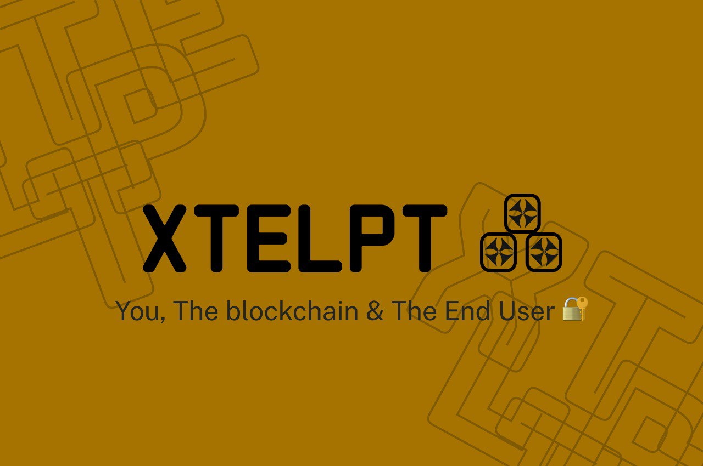

 
<p align="center">
<a target="_blank" href="https://docs.soliditylang.org/"></a> <a target="_blank" href="https://docs.chain.link/"></a><a target="_blank" href=""></a?

</p>
<p align="center">
  This repository contains the <strong>Smart contract</strong> source code written <b>Solidity</b>, The <strong>Frontend</strong> written in <b>NextJS</b> a Javascript Framework.
  Xtelpt is about Getting mental health care anywhere at anytime at 100% confidentiality.
</p>

<p align="center">
<a href="#introduction">Frameworks and APis</a> &nbsp;&bull;&nbsp;
<a href="#usage">Usage</a> &nbsp;&bull;&nbsp;
<a href="#issue">Issues?</a>&nbsp;&bull;&nbsp;
<a href="#documentation">Lesson and Remarks</a> &nbsp;&bull;&nbsp;
</p>

# Frameworks & API's
This <b>Project</b> was made possible with ```solidity```, ```hardhat```, ```chainlink```, ```quicknode```, ```IPFS```, ```NextJS```, ```HUDDLE01```, ```Polygon```, ```Git```, ```Chai```, ```EtherJS```, and ```Figma```. It's has features such as:

- Creating of user or in this case a client profile.
- Creating of a host or doctors profile.
- Ability for a host to create a meeting and a user to enter the meeting.
- Becoming a volunteer for a campaign.
- Add profile name, pictures, bio and profession.
- A Decentralized WEBRTC for calls.
- Notification.
- Creating Schedules for Hosts.

### LINKS 
[Live Deployed]() <br/>
[Contract]()
> **Note**
> Wallet must be Connected to access any feature.

## Usage
### How it works for Host:<br/>
- On opening of XTELPT and connecting of wallet, toggle on the host button to become a host while signing up.
- Edit your profile based on your professionalism.
- Set Schedule based on your preferred time and fee.
- Voluteer as a host on campaign(non-paid service)
- Get all meeting schedule on the notification bar, wait for time and click on it and start meeting.

### How Campaign Works:<br/>
- Navigate to campaign at the top bar and click on it.
- Search for specifics campaign or scroll down and click Get Help.
- The system automatically merges you with a Host and a call link will be in your notification.
- click and wait for prompts.

### Incoming Community Feature:<br/>
- xtelpt is enacting a reward gifting system for uncoerced individuals for being in stilt to others and sharing remedies for them in times of need in the community , xtelpt communites will serve as a trestle for mental health awareness programs where individuals can obliterate self-stigmatization, learning from previous experiences and getting to see ratified solutions of near same problem they are facing.


## Issues
This repository is maintained actively, so if you face any issue please <a href="https://github.com/Xprj3ct/xtelpt-web3/issues/new">raise an issue</a>.

## Lesson and Remarks 
